# SheBalance Website Architecture

## Overview
SheBalance is a comprehensive AI-powered women's empowerment platform designed to help women balance household responsibilities with career development. The platform provides skill assessment, learning opportunities, job matching, and community support through an intuitive web interface.

## System Architecture

### High-Level System Overview

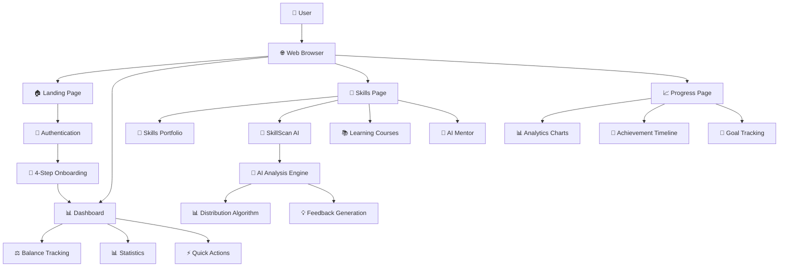

### Frontend Architecture
The SheBalance platform follows a **Multi-Page Application (MPA)** architecture with shared components and consistent design patterns.

```
┌─────────────────────────────────────────────────────────────┐
│                    SheBalance Frontend                      │
├─────────────────────────────────────────────────────────────┤
│  Landing Page        │  Dashboard Pages                     │
│  ┌─────────────────┐ │  ┌─────────────────────────────────┐ │
│  │ index.html      │ │  │ dashboard.html                  │ │
│  │ styles.css      │ │  │ skills.html                     │ │
│  │ script.js       │ │  │ progress.html                   │ │
│  └─────────────────┘ │  └─────────────────────────────────┘ │
├─────────────────────────────────────────────────────────────┤
│                   Shared Components                         │
│  ┌─────────────────────────────────────────────────────────┐ │
│  │ Navigation System │ Modal Components │ AI Integration  │ │
│  │ Notification Sys  │ Translation Eng  │ Voice Commands  │ │
│  └─────────────────────────────────────────────────────────┘ │
├─────────────────────────────────────────────────────────────┤
│                   Shared Resources                          │
│  ┌─────────────────────────────────────────────────────────┐ │
│  │ dashboard.css (3,769 lines) │ JavaScript Modules       │ │
│  │ Font Awesome Icons          │ Chart.js Integration     │ │
│  │ Google Fonts               │ Local Storage Manager    │ │
│  └─────────────────────────────────────────────────────────┘ │
└─────────────────────────────────────────────────────────────┘
```

## File Structure & Organization

### Project File Structure Diagram

```
SheBalance Website
├── 📄 index.html              # Landing page with hero, features, testimonials
├── 📄 dashboard.html          # Main dashboard with balance tracking
├── 📄 skills.html            # Skills portfolio and SkillScan AI
├── 📄 progress.html          # Detailed analytics and progress charts
├── 🎨 styles.css             # Landing page specific styles (1,500+ lines)
├── 🎨 dashboard.css          # Shared dashboard styles (3,769 lines)
├── ⚙️ script.js             # Landing page functionality
├── ⚙️ dashboard.js          # Main dashboard logic
├── ⚙️ dashboard-clean.js    # Enhanced dashboard with Hindi translation
├── ⚙️ skills.js            # Skills management & SkillScan AI (1,900+ lines)
├── ⚙️ progress.js          # Progress charts and analytics
├── 🖼️ image1.jpg - image6.jpg # Carousel and UI images
└── 📁 .kiro/
    ├── 📋 requirements.md     # 70 functional requirements
    ├── 🎨 design.md          # Design system documentation
    └── 🏗️ architecture.md    # This comprehensive architecture file
```

### File Dependencies & Relationships

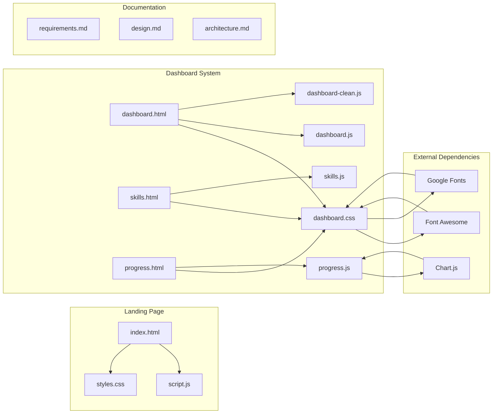

## Component Architecture

### 1. Navigation System Architecture

```
┌─────────────────────────────────────────────────────────────┐
│                    Sidebar Navigation                       │
├─────────────────────────────────────────────────────────────┤
│  ┌─────────────────────────────────────────────────────────┐ │
│  │                 Header Section                          │ │
│  │  ┌─────────────────────────────────────────────────────┐ │ │
│  │  │  SheBalance (Text Logo)                             │ │ │
│  │  └─────────────────────────────────────────────────────┘ │ │
│  └─────────────────────────────────────────────────────────┘ │
│  ┌─────────────────────────────────────────────────────────┐ │
│  │                Navigation Menu                          │ │
│  │  📊 Dashboard                                           │ │
│  │  ⭐ My Skills                                           │ │
│  │  💼 Opportunities                                       │ │
│  │  🍽️ Food Marketplace                                   │ │
│  │  👥 Community                                           │ │
│  │  📈 Progress                                            │ │
│  │  ⚙️ Settings                                            │ │
│  └─────────────────────────────────────────────────────────┘ │
│  ┌─────────────────────────────────────────────────────────┐ │
│  │                Footer Section                           │ │
│  │  🚪 Logout                                              │ │
│  └─────────────────────────────────────────────────────────┘ │
└─────────────────────────────────────────────────────────────┘
```

### 2. Dashboard Component Architecture

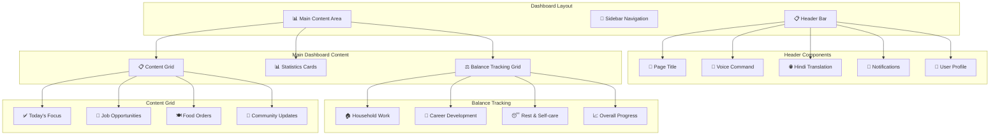

### 3. SkillScan AI System Architecture

```
┌─────────────────────────────────────────────────────────────┐
│                    SkillScan AI System                      │
├─────────────────────────────────────────────────────────────┤
│  ┌─────────────────────────────────────────────────────────┐ │
│  │                Upload Component                         │ │
│  │  ┌─────────────────┐  ┌─────────────────────────────────┐ │ │
│  │  │ Drag & Drop     │  │ File Validation                 │ │ │
│  │  │ • Multi-file    │  │ • Image types only             │ │ │
│  │  │ • 5 max files   │  │ • 10MB max size                │ │ │
│  │  │ • Visual feedback│  │ • Error handling               │ │ │
│  │  └─────────────────┘  └─────────────────────────────────┘ │ │
│  └─────────────────────────────────────────────────────────┘ │
│  ┌─────────────────────────────────────────────────────────┐ │
│  │              Category Selection                         │ │
│  │  🧵 Embroidery  👩‍🍳 Cooking    🎨 Henna Art           │ │
│  │  🧶 Crochet     ✂️ Tailoring   🎭 Crafts              │ │
│  └─────────────────────────────────────────────────────────┘ │
│  ┌─────────────────────────────────────────────────────────┐ │
│  │                AI Analysis Engine                       │ │
│  │  ┌─────────────────────────────────────────────────────┐ │ │
│  │  │         Distribution Algorithm                      │ │ │
│  │  │  • 30% Beginner    • 50% Intermediate              │ │ │
│  │  │  • 20% Advanced    • Smart Balancing               │ │ │
│  │  │  • Consistency Cache • Recent Results Tracking     │ │ │
│  │  └─────────────────────────────────────────────────────┘ │ │
│  │  ┌─────────────────────────────────────────────────────┐ │ │
│  │  │            Feedback Generation                      │ │ │
│  │  │  • Skill-specific strengths                        │ │ │
│  │  │  • Improvement suggestions                          │ │ │
│  │  │  • Level-appropriate advice                        │ │ │
│  │  └─────────────────────────────────────────────────────┘ │ │
│  └─────────────────────────────────────────────────────────┘ │
│  ┌─────────────────────────────────────────────────────────┐ │
│  │               Results Display                           │ │
│  │  ┌─────────────┐ ┌─────────────┐ ┌─────────────────────┐ │ │
│  │  │ Overall     │ │ Detailed    │ │ AI Feedback &       │ │ │
│  │  │ Score       │ │ Breakdown   │ │ Suggestions         │ │ │
│  │  │ Circle      │ │ Progress    │ │ • Strengths         │ │ │
│  │  │ Animation   │ │ Bars        │ │ • Improvements      │ │ │
│  │  └─────────────┘ └─────────────┘ └─────────────────────┘ │ │
│  └─────────────────────────────────────────────────────────┘ │
└─────────────────────────────────────────────────────────────┘
```

### 4. Progress Analytics System Architecture

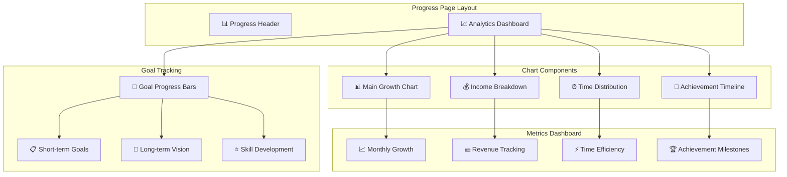

### 5. AI Integration Layer Architecture

```
┌─────────────────────────────────────────────────────────────┐
│                    AI Integration Layer                     │
├─────────────────────────────────────────────────────────────┤
│  ┌─────────────────────────────────────────────────────────┐ │
│  │                SkillScan AI Engine                      │ │
│  │  ┌─────────────────────────────────────────────────────┐ │ │
│  │  │            Core AI Components                       │ │ │
│  │  │  • Image Analysis Processing                        │ │ │
│  │  │  • Skill Level Classification                       │ │ │
│  │  │  • Pattern Recognition                              │ │ │
│  │  │  • Quality Assessment                               │ │ │
│  │  └─────────────────────────────────────────────────────┘ │ │
│  │  ┌─────────────────────────────────────────────────────┐ │ │
│  │  │        Distribution Management                      │ │ │
│  │  │  • Recent Results Tracking (20 max)                │ │ │
│  │  │  • Target Distribution (30/50/20)                  │ │ │
│  │  │  • Probability Adjustment Algorithm                │ │ │
│  │  │  • Consistency Cache System                        │ │ │
│  │  └─────────────────────────────────────────────────────┘ │ │
│  └─────────────────────────────────────────────────────────┘ │
│  ┌─────────────────────────────────────────────────────────┐ │
│  │              AI Chatbot System                          │ │
│  │  ┌─────────────────────────────────────────────────────┐ │ │
│  │  │           Conversation Engine                       │ │ │
│  │  │  • Personalized Responses                           │ │ │
│  │  │  • Context-Aware Suggestions                        │ │ │
│  │  │  • Learning Roadmap Generation                      │ │ │
│  │  │  • Career Guidance                                  │ │ │
│  │  └─────────────────────────────────────────────────────┘ │ │
│  │  ┌─────────────────────────────────────────────────────┐ │ │
│  │  │          Response Categories                        │ │ │
│  │  │  • Learning Roadmaps                                │ │ │
│  │  │  • Skill Improvement Tips                           │ │ │
│  │  │  • Job Opportunities                                │ │ │
│  │  │  • Work-Life Balance                                │ │ │
│  │  └─────────────────────────────────────────────────────┘ │ │
│  └─────────────────────────────────────────────────────────┘ │
│  ┌─────────────────────────────────────────────────────────┐ │
│  │             Voice Command System                        │ │
│  │  • Speech Recognition                                   │ │
│  │  • Command Processing                                   │ │
│  │  • Multilingual Support (English/Hindi)                │ │
│  │  • Audio Feedback                                       │ │
│  └─────────────────────────────────────────────────────────┘ │
└─────────────────────────────────────────────────────────────┘
```

## Data Architecture

### Data Flow Diagram

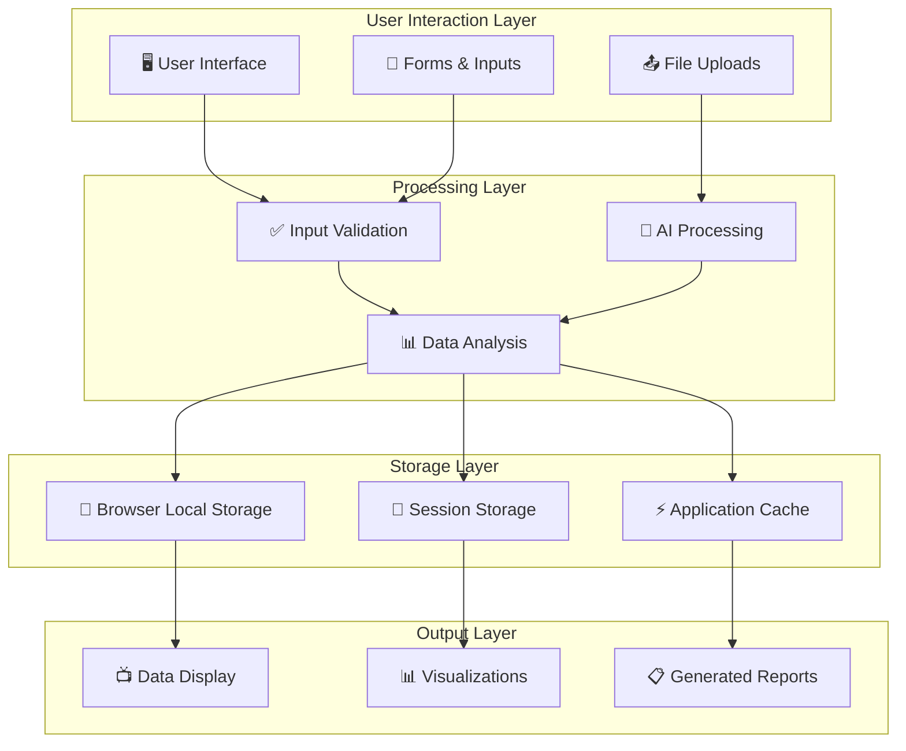

### Local Storage Structure

```javascript
// Complete Local Storage Architecture
{
  // Core User Data
  shebalance_user_data: {
    fullName: "Rukaiya Ghadiali",
    email: "user@example.com",
    phone: "+91-XXXXXXXXXX",
    location: "Mumbai, India",
    
    // Onboarding Data
    householdWork: [
      { task: "Cooking", hours: 2, difficulty: "Medium" },
      { task: "Cleaning", hours: 1.5, difficulty: "Easy" },
      { task: "Childcare", hours: 3, difficulty: "High" }
    ],
    
    skills: [
      { name: "Embroidery", level: "Advanced", score: 92 },
      { name: "Cooking", level: "Intermediate", score: 78 },
      { name: "Henna Art", level: "Beginner", score: 45 }
    ],
    
    preferences: {
      language: "en", // or "hi"
      notifications: true,
      voiceCommands: true,
      theme: "default"
    },
    
    goals: {
      shortTerm: ["Complete embroidery course", "Earn ₹5000/month"],
      longTerm: ["Start own business", "Achieve work-life balance"]
    }
  },
  
  // SkillScan AI Data
  skillscan_recent_results: [
    "Intermediate", "Beginner", "Advanced", "Intermediate", "Beginner"
    // Last 20 results for distribution balancing
  ],
  
  skillscan_image_cache: {
    "embroidery_abc123": {
      analysis: { score: 85, level: "Advanced" },
      timestamp: "2024-01-15T10:30:00Z"
    }
  },
  
  // Progress Tracking Data
  progress_data: {
    dailyStats: {
      "2024-01-15": {
        household: 6.5, // hours
        career: 4.25,
        rest: 2.75,
        income: 850 // rupees
      }
    },
    
    achievements: [
      {
        title: "First SkillScan Complete",
        date: "2024-01-10",
        type: "milestone"
      }
    ],
    
    goals: {
      monthly_income: { target: 15000, current: 8500 },
      skill_development: { target: 5, current: 3 },
      work_life_balance: { target: 80, current: 68 }
    }
  },
  
  // Application State
  app_state: {
    onboarding_completed: true,
    current_page: "dashboard",
    last_login: "2024-01-15T09:00:00Z",
    session_id: "sess_abc123xyz"
  },
  
  // Translation Cache
  translation_cache: {
    "en_to_hi": {
      "Dashboard": "डैशबोर्ड",
      "My Skills": "मेरे कौशल",
      "Progress": "प्रगति"
      // Cached translations for performance
    }
  }
}
```

## UI/UX Architecture

### Design System Hierarchy

```
┌─────────────────────────────────────────────────────────────┐
│                    SheBalance Design System                 │
├─────────────────────────────────────────────────────────────┤
│  ┌─────────────────────────────────────────────────────────┐ │
│  │                 Color Palette                           │ │
│  │  ┌─────────────┐ ┌─────────────┐ ┌─────────────────────┐ │ │
│  │  │ Primary     │ │ Secondary   │ │ Accent              │ │ │
│  │  │ Beige       │ │ Wooden      │ │ Burnt Orange        │ │ │
│  │  │ #F5F5DC     │ │ Brown       │ │ #CC5500             │ │ │
│  │  │             │ │ #5D4037     │ │                     │ │ │
│  │  └─────────────┘ └─────────────┘ └─────────────────────┘ │ │
│  │  ┌─────────────┐ ┌─────────────┐ ┌─────────────────────┐ │ │
│  │  │ Success     │ │ Warning     │ │ Error               │ │ │
│  │  │ #10b981     │ │ #f59e0b     │ │ #ef4444             │ │ │
│  │  └─────────────┘ └─────────────┘ └─────────────────────┘ │ │
│  └─────────────────────────────────────────────────────────┘ │
│  ┌─────────────────────────────────────────────────────────┐ │
│  │                Typography System                        │ │
│  │  ┌─────────────────────────────────────────────────────┐ │ │
│  │  │ Primary Font: Inter (Sans-serif)                    │ │ │
│  │  │ • Body text, UI elements, navigation                │ │ │
│  │  │ • Weights: 300, 400, 500, 600, 700, 800            │ │ │
│  │  └─────────────────────────────────────────────────────┘ │ │
│  │  ┌─────────────────────────────────────────────────────┐ │ │
│  │  │ Heading Font: Playfair Display (Serif)              │ │ │
│  │  │ • Main headings, hero text, emphasis                │ │ │
│  │  │ • Weights: 400, 600, 700                            │ │ │
│  │  └─────────────────────────────────────────────────────┘ │ │
│  │  ┌─────────────────────────────────────────────────────┐ │ │
│  │  │ UI Font: Poppins (Sans-serif)                       │ │ │
│  │  │ • Buttons, labels, notifications                    │ │ │
│  │  │ • Clean, modern appearance                          │ │ │
│  │  └─────────────────────────────────────────────────────┘ │ │
│  └─────────────────────────────────────────────────────────┘ │
└─────────────────────────────────────────────────────────────┘
```

### Layout System Architecture

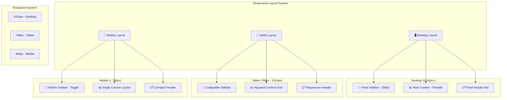

### Component Layout Structure

```
┌─────────────────────────────────────────────────────────────┐
│                    Page Layout Structure                    │
├─────────────────────────────────────────────────────────────┤
│ ┌─────────────┐ ┌─────────────────────────────────────────┐ │
│ │             │ │              Header Bar                 │ │
│ │             │ │ ┌─────────┐ ┌─────────┐ ┌─────────────┐ │ │
│ │   Sidebar   │ │ │ Title   │ │ Actions │ │ User Profile│ │ │
│ │             │ │ └─────────┘ └─────────┘ └─────────────┘ │ │
│ │ ┌─────────┐ │ ├─────────────────────────────────────────┤ │
│ │ │ Logo    │ │ │                                         │ │
│ │ └─────────┘ │ │                                         │ │
│ │             │ │                                         │ │
│ │ ┌─────────┐ │ │            Main Content                 │ │
│ │ │ Nav     │ │ │                                         │ │
│ │ │ Menu    │ │ │  ┌─────────────────────────────────────┐ │ │
│ │ │         │ │ │  │         Content Grid               │ │ │
│ │ │ • Home  │ │ │  │  ┌─────────┐ ┌─────────────────────┐ │ │ │
│ │ │ • Skills│ │ │  │  │ Card 1  │ │      Card 2         │ │ │ │
│ │ │ • Prog  │ │ │  │  └─────────┘ └─────────────────────┘ │ │ │
│ │ │ • etc   │ │ │  │  ┌─────────┐ ┌─────────────────────┐ │ │ │
│ │ └─────────┘ │ │  │  │ Card 3  │ │      Card 4         │ │ │ │
│ │             │ │  │  └─────────┘ └─────────────────────┘ │ │ │
│ │ ┌─────────┐ │ │  └─────────────────────────────────────┘ │ │
│ │ │ Logout  │ │ │                                         │ │
│ │ └─────────┘ │ │                                         │ │
│ └─────────────┘ └─────────────────────────────────────────┘ │
└─────────────────────────────────────────────────────────────┘
```

## Feature Modules Architecture

### 1. User Onboarding System Flow

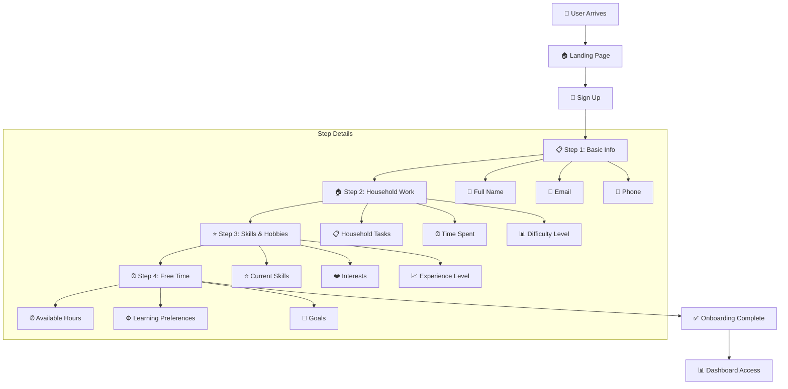

### 2. Voice Command Integration Architecture

```
┌─────────────────────────────────────────────────────────────┐
│                Voice Command System                         │
├─────────────────────────────────────────────────────────────┤
│  ┌─────────────────────────────────────────────────────────┐ │
│  │              Input Processing                           │ │
│  │  ┌─────────────────┐  ┌─────────────────────────────────┐ │ │
│  │  │ Speech          │  │ Language Detection              │ │ │
│  │  │ Recognition     │  │ • English                       │ │ │
│  │  │ • Web API       │  │ • Hindi                         │ │ │
│  │  │ • Real-time     │  │ • Auto-detect                   │ │ │
│  │  └─────────────────┘  └─────────────────────────────────┘ │ │
│  └─────────────────────────────────────────────────────────┘ │
│  ┌─────────────────────────────────────────────────────────┐ │
│  │             Command Processing                          │ │
│  │  ┌─────────────────────────────────────────────────────┐ │ │
│  │  │              Command Categories                     │ │ │
│  │  │  • Navigation: "Go to skills page"                 │ │ │
│  │  │  • Actions: "Start skill scan"                     │ │ │
│  │  │  • Queries: "Show my progress"                     │ │ │
│  │  │  • Settings: "Switch to Hindi"                     │ │ │
│  │  └─────────────────────────────────────────────────────┘ │ │
│  └─────────────────────────────────────────────────────────┘ │
│  ┌─────────────────────────────────────────────────────────┐ │
│  │               Response System                           │ │
│  │  • Visual feedback (animations)                        │ │
│  │  • Audio confirmation                                   │ │
│  │  • Action execution                                     │ │
│  │  • Error handling                                       │ │
│  └─────────────────────────────────────────────────────────┘ │
└─────────────────────────────────────────────────────────────┘
```

### 3. Translation System Architecture

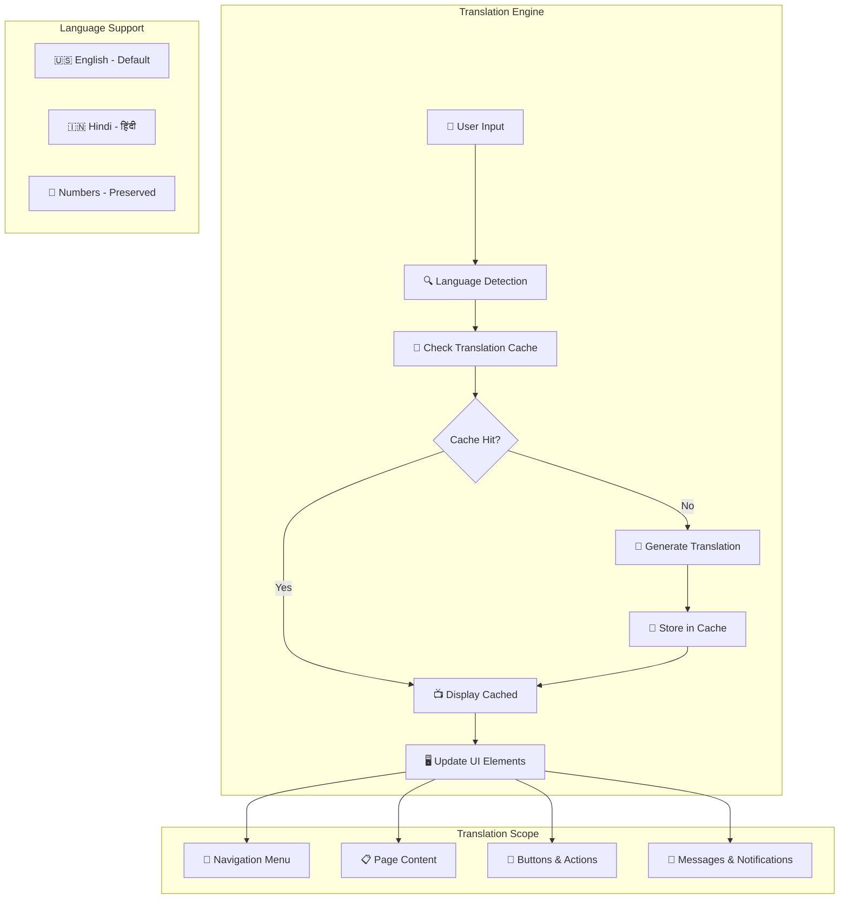

### 4. Learning Management System Flow

```
┌─────────────────────────────────────────────────────────────┐
│                Learning Management System                   │
├─────────────────────────────────────────────────────────────┤
│  ┌─────────────────────────────────────────────────────────┐ │
│  │                Course Catalog                           │ │
│  │  ┌─────────────┐ ┌─────────────┐ ┌─────────────────────┐ │ │
│  │  │ Advanced    │ │ Professional│ │ Cross Stitch        │ │ │
│  │  │ Crochet     │ │ Tailoring   │ │ Artistry            │ │ │
│  │  │ ₹2,999      │ │ ₹3,499      │ │ ₹1,999              │ │ │
│  │  │ 6 weeks     │ │ 8 weeks     │ │ 4 weeks             │ │ │
│  │  └─────────────┘ └─────────────┘ └─────────────────────┘ │ │
│  └─────────────────────────────────────────────────────────┘ │
│  ┌─────────────────────────────────────────────────────────┐ │
│  │              Payment Options                            │ │
│  │  ┌─────────────────────────────────────────────────────┐ │ │
│  │  │                Full Payment                         │ │ │
│  │  │  • One-time payment                                 │ │ │
│  │  │  • Immediate access                                 │ │ │
│  │  │  • No additional fees                               │ │ │
│  │  └─────────────────────────────────────────────────────┘ │ │
│  │  ┌─────────────────────────────────────────────────────┐ │ │
│  │  │              EMI Options                            │ │ │
│  │  │  • 0% Interest EMI                                  │ │ │
│  │  │  • Flexible duration                                │ │ │
│  │  │  • Monthly payment plans                            │ │ │
│  │  │  • Automatic deduction                              │ │ │
│  │  └─────────────────────────────────────────────────────┘ │ │
│  └─────────────────────────────────────────────────────────┘ │
│  ┌─────────────────────────────────────────────────────────┐ │
│  │             Progress Tracking                           │ │
│  │  • Course completion percentage                         │ │
│  │  • Module-wise progress                                 │ │
│  │  • Skill development metrics                            │ │
│  │  • Certificate generation                               │ │
│  └─────────────────────────────────────────────────────────┘ │
└─────────────────────────────────────────────────────────────┘
```

## Performance Architecture

### Performance Optimization Strategy

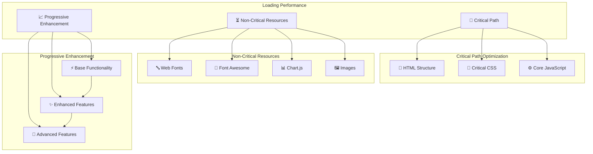

### Resource Loading Strategy

```
┌─────────────────────────────────────────────────────────────┐
│                Resource Loading Timeline                    │
├─────────────────────────────────────────────────────────────┤
│  ┌─────────────────────────────────────────────────────────┐ │
│  │                Initial Load (0-1s)                      │ │
│  │  • HTML structure                                       │ │
│  │  • Critical CSS (inline)                                │ │
│  │  • Core JavaScript                                      │ │
│  │  • Above-fold content                                   │ │
│  └─────────────────────────────────────────────────────────┘ │
│  ┌─────────────────────────────────────────────────────────┐ │
│  │              Secondary Load (1-2s)                      │ │
│  │  • Non-critical CSS                                     │ │
│  │  • Web fonts (with fallbacks)                           │ │
│  │  • Icon libraries                                       │ │
│  │  • Below-fold content                                   │ │
│  └─────────────────────────────────────────────────────────┘ │
│  ┌─────────────────────────────────────────────────────────┐ │
│  │               Deferred Load (2s+)                       │ │
│  │  • Chart.js library                                     │ │
│  │  • Advanced features                                    │ │
│  │  • Analytics scripts                                    │ │
│  │  • Non-essential images                                 │ │
│  └─────────────────────────────────────────────────────────┘ │
└─────────────────────────────────────────────────────────────┘
```

### Memory Management Architecture

```
┌─────────────────────────────────────────────────────────────┐
│                Memory Management Strategy                   │
├─────────────────────────────────────────────────────────────┤
│  ┌─────────────────────────────────────────────────────────┐ │
│  │              DOM Management                             │ │
│  │  • Efficient DOM queries                                │ │
│  │  • Event listener cleanup                               │ │
│  │  • Memory leak prevention                               │ │
│  │  • Garbage collection optimization                      │ │
│  └─────────────────────────────────────────────────────────┘ │
│  ┌─────────────────────────────────────────────────────────┐ │
│  │             Data Management                             │ │
│  │  • Local storage optimization                           │ │
│  │  • Cache management                                     │ │
│  │  • Data structure efficiency                            │ │
│  │  • Memory usage monitoring                              │ │
│  └─────────────────────────────────────────────────────────┘ │
│  ┌─────────────────────────────────────────────────────────┐ │
│  │            Resource Cleanup                             │ │
│  │  • Image memory management                              │ │
│  │  • Chart instance cleanup                               │ │
│  │  • Timer and interval cleanup                           │ │
│  │  • WebAPI resource management                           │ │
│  └─────────────────────────────────────────────────────────┘ │
└─────────────────────────────────────────────────────────────┘
```

## Security Architecture

### Data Protection
- Client-side data encryption for sensitive information
- Secure local storage practices
- Input validation and sanitization
- XSS protection measures

### Privacy Considerations
- Minimal data collection
- User consent management
- Data retention policies
- Secure file upload handling

## Integration Points

### External Services
1. **Font Awesome**: Icon library
2. **Google Fonts**: Typography
3. **Chart.js**: Data visualization
4. **Web APIs**: File handling, speech recognition

### Future Integration Readiness
- RESTful API endpoints structure
- Authentication system hooks
- Database integration points
- Third-party service connectors

## ☁️ **AWS Services Architecture**

### **Complete AWS Services Ecosystem Diagram**

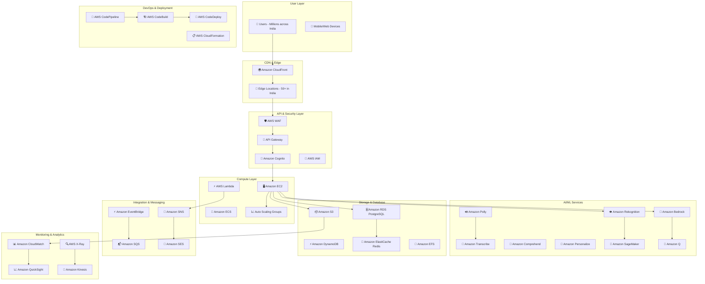

### **AWS Services by Category - Visual Breakdown**

```
┌─────────────────────────────────────────────────────────────┐
│                    AWS Services Architecture                │
├─────────────────────────────────────────────────────────────┤
│  ┌─────────────────────────────────────────────────────────┐ │
│  │                 Frontend & CDN                          │ │
│  │  ┌─────────────┐ ┌─────────────┐ ┌─────────────────────┐ │ │
│  │  │ AWS Amplify │ │ CloudFront  │ │ Route 53            │ │ │
│  │  │ Web Hosting │ │ Global CDN  │ │ DNS Management      │ │ │
│  │  │ CI/CD       │ │ 50+ Edge    │ │ Health Checks       │ │ │
│  │  │ Git Deploy  │ │ Locations   │ │ Domain Config       │ │ │
│  │  └─────────────┘ └─────────────┘ └─────────────────────┘ │ │
│  │  ┌─────────────────────────────────────────────────────┐ │ │
│  │  │ S3 Static Website (via Amplify)                     │ │ │
│  │  │ • Automatic builds from Git repository              │ │ │
│  │  │ • Built-in SSL/TLS certificates                     │ │ │
│  │  │ • Global CDN distribution                           │ │ │
│  │  │ • Preview deployments for branches                  │ │ │
│  │  └─────────────────────────────────────────────────────┘ │ │
│  └─────────────────────────────────────────────────────────┘ │
│  ┌─────────────────────────────────────────────────────────┐ │
│  │                Security & Access                        │ │
│  │  ┌─────────────┐ ┌─────────────┐ ┌─────────────────────┐ │ │
│  │  │ AWS WAF     │ │ Cognito     │ │ IAM                 │ │ │
│  │  │ Web App     │ │ User Auth   │ │ Access Control      │ │ │
│  │  │ Firewall    │ │ Identity    │ │ Role Management     │ │ │
│  │  │ DDoS Protect│ │ Management  │ │ Policy Engine       │ │ │
│  │  └─────────────┘ └─────────────┘ └─────────────────────┘ │ │
│  └─────────────────────────────────────────────────────────┘ │
│  ┌─────────────────────────────────────────────────────────┐ │
│  │                 API & Integration                       │ │
│  │  ┌─────────────┐ ┌─────────────┐ ┌─────────────────────┐ │ │
│  │  │ API Gateway │ │ EventBridge │ │ Step Functions      │ │ │
│  │  │ REST APIs   │ │ Event Bus   │ │ Workflow            │ │ │
│  │  │ WebSocket   │ │ Scheduling  │ │ Orchestration       │ │ │
│  │  │ Rate Limit  │ │ Integration │ │ State Management    │ │ │
│  │  └─────────────┘ └─────────────┘ └─────────────────────┘ │ │
│  └─────────────────────────────────────────────────────────┘ │
│  ┌─────────────────────────────────────────────────────────┐ │
│  │                 Compute Services                        │ │
│  │  ┌─────────────┐ ┌─────────────┐ ┌─────────────────────┐ │ │
│  │  │ EC2         │ │ Lambda      │ │ ECS/Fargate         │ │ │
│  │  │ Virtual     │ │ Serverless  │ │ Container           │ │ │
│  │  │ Servers     │ │ Functions   │ │ Orchestration       │ │ │
│  │  │ Auto Scale  │ │ Event Drive │ │ Microservices       │ │ │
│  │  └─────────────┘ └─────────────┘ └─────────────────────┘ │ │
│  └─────────────────────────────────────────────────────────┘ │
│  ┌─────────────────────────────────────────────────────────┐ │
│  │                   AI/ML Services                        │ │
│  │  ┌─────────────┐ ┌─────────────┐ ┌─────────────────────┐ │ │
│  │  │ Bedrock     │ │ Rekognition │ │ SageMaker           │ │ │
│  │  │ Foundation  │ │ Computer    │ │ ML Platform         │ │ │
│  │  │ Models      │ │ Vision      │ │ Model Training      │ │ │
│  │  │ Claude/GPT  │ │ Image AI    │ │ Deployment          │ │ │
│  │  └─────────────┘ └─────────────┘ └─────────────────────┘ │ │
│  │  ┌─────────────┐ ┌─────────────┐ ┌─────────────────────┐ │ │
│  │  │ Polly       │ │ Transcribe  │ │ Comprehend          │ │ │
│  │  │ Text-to-    │ │ Speech-to-  │ │ Natural Language    │ │ │
│  │  │ Speech      │ │ Text        │ │ Processing          │ │ │
│  │  │ Multi-Lang  │ │ Real-time   │ │ Sentiment Analysis  │ │ │
│  │  └─────────────┘ └─────────────┘ └─────────────────────┘ │ │
│  │  ┌─────────────┐ ┌─────────────┐ ┌─────────────────────┐ │ │
│  │  │ Personalize │ │ Amazon Q    │ │ Textract            │ │ │
│  │  │ ML Recomm   │ │ Business    │ │ Document            │ │ │
│  │  │ Engine      │ │ Intelligence│ │ Analysis            │ │ │
│  │  │ Real-time   │ │ Chatbot     │ │ OCR Service         │ │ │
│  │  └─────────────┘ └─────────────┘ └─────────────────────┘ │ │
│  └─────────────────────────────────────────────────────────┘ │
│  ┌─────────────────────────────────────────────────────────┐ │
│  │                Storage & Database                       │ │
│  │  ┌─────────────┐ ┌─────────────┐ ┌─────────────────────┐ │ │
│  │  │ RDS         │ │ DynamoDB    │ │ S3                  │ │ │
│  │  │ PostgreSQL  │ │ NoSQL       │ │ Object Storage      │ │ │
│  │  │ Multi-AZ    │ │ Serverless  │ │ Data Lake           │ │ │
│  │  │ Read Replica│ │ Global      │ │ Static Assets       │ │ │
│  │  └─────────────┘ └─────────────┘ └─────────────────────┘ │ │
│  │  ┌─────────────┐ ┌─────────────┐ ┌─────────────────────┐ │ │
│  │  │ ElastiCache │ │ EFS         │ │ Glacier             │ │ │
│  │  │ Redis       │ │ File System │ │ Archive Storage     │ │ │
│  │  │ In-Memory   │ │ Shared      │ │ Long-term Backup    │ │ │
│  │  │ Caching     │ │ Storage     │ │ Cost Optimization   │ │ │
│  │  └─────────────┘ └─────────────┘ └─────────────────────┘ │ │
│  └─────────────────────────────────────────────────────────┘ │
│  ┌─────────────────────────────────────────────────────────┐ │
│  │              Messaging & Notifications                  │ │
│  │  ┌─────────────┐ ┌─────────────┐ ┌─────────────────────┐ │ │
│  │  │ SNS         │ │ SQS         │ │ SES                 │ │ │
│  │  │ Push        │ │ Message     │ │ Email Service       │ │ │
│  │  │ Notifications│ │ Queue       │ │ Transactional       │ │ │
│  │  │ Multi-channel│ │ Decoupling  │ │ Marketing Emails    │ │ │
│  │  └─────────────┘ └─────────────┘ └─────────────────────┘ │ │
│  └─────────────────────────────────────────────────────────┘ │
│  ┌─────────────────────────────────────────────────────────┐ │
│  │            Monitoring & Analytics                       │ │
│  │  ┌─────────────┐ ┌─────────────┐ ┌─────────────────────┐ │ │
│  │  │ CloudWatch  │ │ X-Ray       │ │ QuickSight          │ │ │
│  │  │ Monitoring  │ │ Distributed │ │ Business            │ │ │
│  │  │ Metrics     │ │ Tracing     │ │ Intelligence        │ │ │
│  │  │ Alarms      │ │ Performance │ │ Data Visualization  │ │ │
│  │  └─────────────┘ └─────────────┘ └─────────────────────┘ │ │
│  │  ┌─────────────┐ ┌─────────────┐ ┌─────────────────────┐ │ │
│  │  │ Kinesis     │ │ OpenSearch  │ │ Cost Explorer       │ │ │
│  │  │ Real-time   │ │ Search &    │ │ Cost Management     │ │ │
│  │  │ Data Stream │ │ Analytics   │ │ Budget Alerts       │ │ │
│  │  │ Processing  │ │ Log Analysis│ │ Usage Optimization  │ │ │
│  │  └─────────────┘ └─────────────┘ └─────────────────────┘ │ │
│  └─────────────────────────────────────────────────────────┘ │
└─────────────────────────────────────────────────────────────┘
```

### **Regional AWS Infrastructure for India**

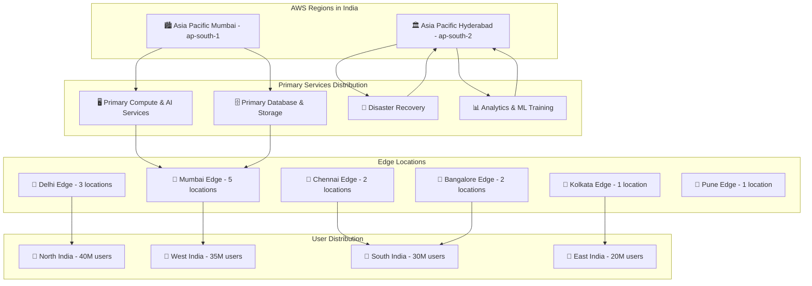

### **Data Flow Architecture with AWS Services**

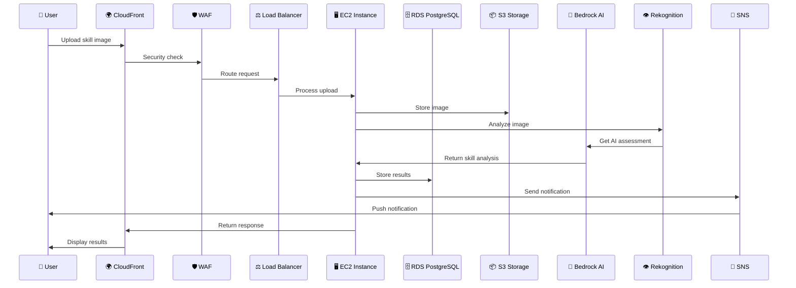

### **AI Services Integration Flow**

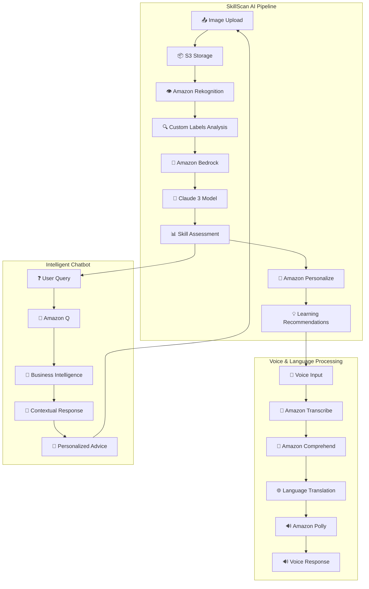

### **Cost Optimization Architecture**

```
┌─────────────────────────────────────────────────────────────┐
│                AWS Cost Optimization Strategy               │
├─────────────────────────────────────────────────────────────┤
│  ┌─────────────────────────────────────────────────────────┐ │
│  │                Compute Optimization                     │ │
│  │  ┌─────────────┐ ┌─────────────┐ ┌─────────────────────┐ │ │
│  │  │ Reserved    │ │ Spot        │ │ Auto Scaling        │ │ │
│  │  │ Instances   │ │ Instances   │ │ Groups              │ │ │
│  │  │ 1-3 year    │ │ 70% savings │ │ Dynamic scaling     │ │ │
│  │  │ commitment  │ │ for batch   │ │ based on demand     │ │ │
│  │  └─────────────┘ └─────────────┘ └─────────────────────┘ │ │
│  └─────────────────────────────────────────────────────────┘ │
│  ┌─────────────────────────────────────────────────────────┐ │
│  │                Storage Optimization                     │ │
│  │  ┌─────────────┐ ┌─────────────┐ ┌─────────────────────┐ │ │
│  │  │ S3          │ │ Intelligent │ │ Lifecycle           │ │ │
│  │  │ Standard    │ │ Tiering     │ │ Policies            │ │ │
│  │  │ Frequent    │ │ Auto-move   │ │ Auto-archive        │ │ │
│  │  │ Access      │ │ data        │ │ old data            │ │ │
│  │  └─────────────┘ └─────────────┘ └─────────────────────┘ │ │
│  └─────────────────────────────────────────────────────────┘ │
│  ┌─────────────────────────────────────────────────────────┐ │
│  │                 AI/ML Optimization                      │ │
│  │  ┌─────────────┐ ┌─────────────┐ ┌─────────────────────┐ │ │
│  │  │ Bedrock     │ │ SageMaker   │ │ Batch Processing    │ │ │
│  │  │ On-demand   │ │ Spot        │ │ Off-peak hours      │ │ │
│  │  │ pricing     │ │ Training    │ │ Cost optimization   │ │ │
│  │  │ Pay per use │ │ 70% savings │ │ Scheduled jobs      │ │ │
│  │  └─────────────┘ └─────────────┘ └─────────────────────┘ │ │
│  └─────────────────────────────────────────────────────────┘ │
└─────────────────────────────────────────────────────────────┘
```

### **Security Architecture with AWS Services**

```mermaid
graph TB
    subgraph "Security Layers"
        WAF[🛡️ AWS WAF - Web Application Firewall]
        Shield[🛡️ AWS Shield - DDoS Protection]
        GuardDuty[🔍 Amazon GuardDuty - Threat Detection]
        Inspector[🔍 Amazon Inspector - Vulnerability Assessment]
    end
    
    subgraph "Identity & Access"
        Cognito[🔐 Amazon Cognito - User Authentication]
        IAM[👤 AWS IAM - Access Management]
        SecretsManager[🔑 AWS Secrets Manager]
        KMS[🔐 AWS KMS - Key Management]
    end
    
    subgraph "Data Protection"
        S3Encryption[🔒 S3 Server-Side Encryption]
        RDSEncryption[🔒 RDS Encryption at Rest]
        TransitEncryption[🔒 TLS/SSL in Transit]
        VPC[🏠 Amazon VPC - Network Isolation]
    end
    
    subgraph "Compliance & Auditing"
        CloudTrail[📋 AWS CloudTrail - API Logging]
        Config[⚙️ AWS Config - Compliance Monitoring]
        Macie[🔍 Amazon Macie - Data Classification]
        SecurityHub[🏢 AWS Security Hub - Central Dashboard]
    end
    
    WAF --> Shield
    Shield --> GuardDuty
    GuardDuty --> Inspector
    
    Cognito --> IAM
    IAM --> SecretsManager
    SecretsManager --> KMS
    
    S3Encryption --> RDSEncryption
    RDSEncryption --> TransitEncryption
    TransitEncryption --> VPC
    
    CloudTrail --> Config
    Config --> Macie
    Macie --> SecurityHub
```

## AWS Amplify Hosting Architecture

### **Overview**
SheBalance web application is hosted using **AWS Amplify**, a fully managed service that provides continuous deployment, hosting, and delivery of static web applications with built-in CI/CD capabilities.

### **AWS Amplify Hosting Benefits**

```
┌─────────────────────────────────────────────────────────────┐
│                AWS Amplify Hosting Features                 │
├─────────────────────────────────────────────────────────────┤
│  ┌─────────────────────────────────────────────────────────┐ │
│  │              Continuous Deployment                      │ │
│  │  ┌─────────────────────────────────────────────────────┐ │ │
│  │  │ • Automatic builds from Git repository (GitHub)     │ │ │
│  │  │ • Triggered on every push to main branch            │ │ │
│  │  │ • Build logs and error tracking                     │ │ │
│  │  │ • Rollback capabilities to previous versions        │ │ │
│  │  └─────────────────────────────────────────────────────┘ │ │
│  └─────────────────────────────────────────────────────────┘ │
│  ┌─────────────────────────────────────────────────────────┐ │
│  │              Global Content Delivery                    │ │
│  │  ┌─────────────────────────────────────────────────────┐ │ │
│  │  │ • CloudFront CDN integration (50+ edge locations)   │ │ │
│  │  │ • Automatic SSL/TLS certificates (HTTPS)            │ │ │
│  │  │ • Custom domain support with Route 53               │ │ │
│  │  │ • Instant cache invalidation on deployment          │ │ │
│  │  └─────────────────────────────────────────────────────┘ │ │
│  └─────────────────────────────────────────────────────────┘ │
│  ┌─────────────────────────────────────────────────────────┐ │
│  │              Preview Deployments                        │ │
│  │  ┌─────────────────────────────────────────────────────┐ │ │
│  │  │ • Branch-based preview URLs for testing            │ │ │
│  │  │ • Pull request previews for code review            │ │ │
│  │  │ • Isolated environments for feature development    │ │ │
│  │  │ • Automatic cleanup of old previews                │ │ │
│  │  └─────────────────────────────────────────────────────┘ │ │
│  └─────────────────────────────────────────────────────────┘ │
│  ┌─────────────────────────────────────────────────────────┐ │
│  │              Performance Optimization                   │ │
│  │  ┌─────────────────────────────────────────────────────┐ │ │
│  │  │ • Automatic image optimization                      │ │ │
│  │  │ • Gzip/Brotli compression                           │ │ │
│  │  │ • HTTP/2 and HTTP/3 support                         │ │ │
│  │  │ • Edge caching for static assets                    │ │ │
│  │  └─────────────────────────────────────────────────────┘ │ │
│  └─────────────────────────────────────────────────────────┘ │
└─────────────────────────────────────────────────────────────┘
```

### **Deployment Workflow**

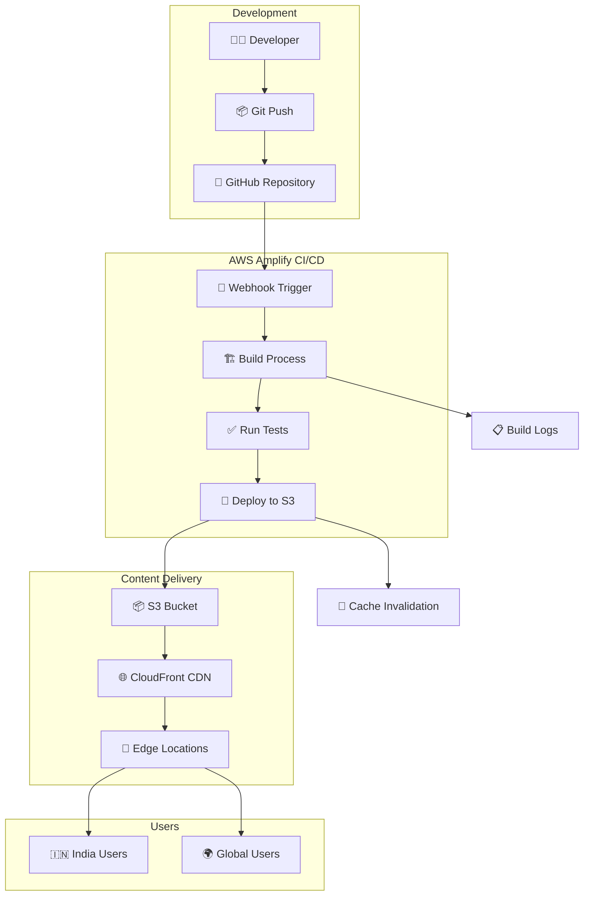

### **Amplify Build Configuration**

```yaml
# amplify.yml - Build specification
version: 1
frontend:
  phases:
    preBuild:
      commands:
        - echo "Pre-build phase - Installing dependencies"
        # No npm/node dependencies for vanilla HTML/CSS/JS
    build:
      commands:
        - echo "Build phase - Preparing static files"
        - echo "Optimizing images and assets"
    postBuild:
      commands:
        - echo "Post-build phase - Deployment preparation"
  artifacts:
    baseDirectory: /
    files:
      - '**/*'
  cache:
    paths: []
```

### **Hosting Architecture Diagram**

```
┌─────────────────────────────────────────────────────────────┐
│                 AWS Amplify Hosting Stack                   │
├─────────────────────────────────────────────────────────────┤
│                                                             │
│  ┌─────────────────────────────────────────────────────────┐ │
│  │                GitHub Repository                        │ │
│  │  • index.html, dashboard.html, skills.html             │ │
│  │  • styles.css, dashboard.css                           │ │
│  │  • script.js, dashboard.js, skills.js                  │ │
│  │  • Images, fonts, and assets                           │ │
│  └─────────────────────────────────────────────────────────┘ │
│                          ↓                                  │
│  ┌─────────────────────────────────────────────────────────┐ │
│  │              AWS Amplify Build                          │ │
│  │  • Automatic build on git push                         │ │
│  │  • Asset optimization and compression                   │ │
│  │  • Build artifact generation                            │ │
│  └─────────────────────────────────────────────────────────┘ │
│                          ↓                                  │
│  ┌─────────────────────────────────────────────────────────┐ │
│  │              Amazon S3 Bucket                           │ │
│  │  • Static website hosting enabled                       │ │
│  │  • Versioned deployments                                │ │
│  │  • Automatic backup and rollback                        │ │
│  └─────────────────────────────────────────────────────────┘ │
│                          ↓                                  │
│  ┌─────────────────────────────────────────────────────────┐ │
│  │            Amazon CloudFront CDN                        │ │
│  │  • Global edge locations (50+)                          │ │
│  │  • SSL/TLS certificate (HTTPS)                          │ │
│  │  • Custom domain: shebalance.com                        │ │
│  │  • Cache optimization and invalidation                  │ │
│  └─────────────────────────────────────────────────────────┘ │
│                          ↓                                  │
│  ┌─────────────────────────────────────────────────────────┐ │
│  │                  End Users                              │ │
│  │  🇮🇳 India (Mumbai, Delhi, Bangalore, Chennai)         │ │
│  │  🌍 Global (Low latency via edge locations)            │ │
│  └─────────────────────────────────────────────────────────┘ │
└─────────────────────────────────────────────────────────────┘
```

### **Domain Configuration**

```
┌─────────────────────────────────────────────────────────────┐
│                  Domain & DNS Setup                         │
├─────────────────────────────────────────────────────────────┤
│  ┌─────────────────────────────────────────────────────────┐ │
│  │              Amazon Route 53                            │ │
│  │  ┌─────────────────────────────────────────────────────┐ │ │
│  │  │ Domain: shebalance.com                              │ │ │
│  │  │ • A Record → CloudFront Distribution                │ │ │
│  │  │ • AAAA Record → IPv6 support                        │ │ │
│  │  │ • CNAME → www.shebalance.com                        │ │ │
│  │  └─────────────────────────────────────────────────────┘ │ │
│  └─────────────────────────────────────────────────────────┘ │
│  ┌─────────────────────────────────────────────────────────┐ │
│  │              SSL/TLS Certificate                        │ │
│  │  ┌─────────────────────────────────────────────────────┐ │ │
│  │  │ AWS Certificate Manager (ACM)                       │ │ │
│  │  │ • Automatic certificate provisioning                │ │ │
│  │  │ • Auto-renewal before expiration                    │ │ │
│  │  │ • Wildcard support: *.shebalance.com                │ │ │
│  │  └─────────────────────────────────────────────────────┘ │ │
│  └─────────────────────────────────────────────────────────┘ │
└─────────────────────────────────────────────────────────────┘
```

### **Monitoring & Analytics**

```javascript
// AWS Amplify provides built-in monitoring
const amplifyMonitoring = {
  metrics: {
    deploymentFrequency: 'Per git push',
    buildDuration: '< 2 minutes',
    deploymentSuccess: '99.9%',
    cacheHitRatio: '> 90%'
  },
  
  cloudWatchIntegration: {
    buildLogs: 'Real-time build logs',
    errorTracking: 'Automatic error detection',
    performanceMetrics: 'Page load times, CDN performance',
    userAnalytics: 'Traffic patterns, geographic distribution'
  },
  
  alerts: {
    buildFailures: 'Email/SNS notifications',
    deploymentErrors: 'Automatic rollback triggers',
    performanceDegradation: 'CloudWatch alarms',
    securityIssues: 'AWS Security Hub integration'
  }
};
```

### **Cost Optimization**

```
┌─────────────────────────────────────────────────────────────┐
│              AWS Amplify Pricing Structure                  │
├─────────────────────────────────────────────────────────────┤
│  ┌─────────────────────────────────────────────────────────┐ │
│  │              Build & Deploy                             │ │
│  │  • Build minutes: First 1,000 free/month               │ │
│  │  • Additional: $0.01 per build minute                   │ │
│  │  • Typical build: 1-2 minutes                           │ │
│  └─────────────────────────────────────────────────────────┘ │
│  ┌─────────────────────────────────────────────────────────┐ │
│  │              Hosting & Storage                          │ │
│  │  • Storage: First 15 GB free/month                      │ │
│  │  • Data transfer: First 15 GB free/month                │ │
│  │  • Additional storage: $0.023 per GB                    │ │
│  │  • Additional transfer: $0.15 per GB                    │ │
│  └─────────────────────────────────────────────────────────┘ │
│  ┌─────────────────────────────────────────────────────────┐ │
│  │              Estimated Monthly Cost                     │ │
│  │  • Small traffic (< 10K visitors): $0 - $5             │ │
│  │  • Medium traffic (10K - 100K): $5 - $50               │ │
│  │  • Large traffic (100K+): $50 - $200                   │ │
│  └─────────────────────────────────────────────────────────┘ │
└─────────────────────────────────────────────────────────────┘
```

### **Deployment Best Practices**

1. **Branch Strategy**
   - `main` branch → Production deployment
   - `develop` branch → Staging environment
   - Feature branches → Preview deployments

2. **Environment Variables**
   - API endpoints configuration
   - Feature flags for gradual rollouts
   - Analytics tracking IDs

3. **Performance Optimization**
   - Enable Gzip/Brotli compression
   - Configure cache headers
   - Optimize image formats (WebP)
   - Minify CSS/JS assets

4. **Security Configuration**
   - Enable HTTPS-only access
   - Configure CORS policies
   - Set security headers (CSP, X-Frame-Options)
   - Enable AWS WAF for DDoS protection

5. **Monitoring & Alerts**
   - Set up CloudWatch alarms for build failures
   - Monitor CDN cache hit ratios
   - Track deployment success rates
   - Configure SNS notifications for critical issues

## Scalability Considerations

### Frontend Scalability
- Modular component architecture
- Reusable CSS classes
- Efficient DOM manipulation
- Memory management best practices

### Code Organization
- Separation of concerns
- DRY principles
- Consistent naming conventions
- Comprehensive documentation

## Development Workflow

### File Dependencies
```
Landing Page (index.html)
├── styles.css
└── script.js

Dashboard Pages
├── dashboard.css (shared)
├── dashboard.js / dashboard-clean.js
├── skills.js (skills.html)
└── progress.js (progress.html)
```

### Build Process
- No build tools required (vanilla implementation)
- Direct file serving
- Manual optimization
- Version control through Git

## Browser Compatibility

### Supported Browsers
- Chrome 80+
- Firefox 75+
- Safari 13+
- Edge 80+

### Progressive Enhancement
- Core functionality without JavaScript
- Enhanced features with JavaScript enabled
- Graceful degradation for older browsers

## Monitoring & Analytics

### Performance Metrics
- Page load times
- User interaction tracking
- Error monitoring
- Feature usage analytics

### User Experience Metrics
- Onboarding completion rates
- Feature adoption
- User engagement patterns
- Skill assessment completion

## Future Architecture Considerations

### Planned System Evolution

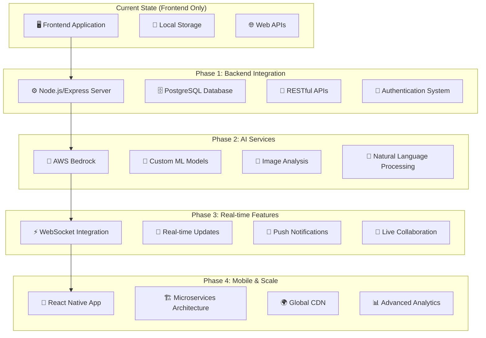

### Microservices Architecture Blueprint

```
┌─────────────────────────────────────────────────────────────┐
│                Future Microservices Architecture            │
├─────────────────────────────────────────────────────────────┤
│  ┌─────────────────────────────────────────────────────────┐ │
│  │                API Gateway                              │ │
│  │  • Request routing                                      │ │
│  │  • Authentication                                       │ │
│  │  • Rate limiting                                        │ │
│  │  • Load balancing                                       │ │
│  └─────────────────────────────────────────────────────────┘ │
│  ┌─────────────────────────────────────────────────────────┐ │
│  │                Core Services                            │ │
│  │  ┌─────────────┐ ┌─────────────┐ ┌─────────────────────┐ │ │
│  │  │ User        │ │ Skills      │ │ Progress            │ │ │
│  │  │ Management  │ │ Management  │ │ Tracking            │ │ │
│  │  │ Service     │ │ Service     │ │ Service             │ │ │
│  │  └─────────────┘ └─────────────┘ └─────────────────────┘ │ │
│  │  ┌─────────────┐ ┌─────────────┐ ┌─────────────────────┐ │ │
│  │  │ Learning    │ │ Community   │ │ Notification        │ │ │
│  │  │ Management  │ │ Service     │ │ Service             │ │ │
│  │  │ Service     │ │             │ │                     │ │ │
│  │  └─────────────┘ └─────────────┘ └─────────────────────┘ │ │
│  └─────────────────────────────────────────────────────────┘ │
│  ┌─────────────────────────────────────────────────────────┐ │
│  │                AI Services                              │ │
│  │  ┌─────────────┐ ┌─────────────┐ ┌─────────────────────┐ │ │
│  │  │ SkillScan   │ │ Chatbot     │ │ Recommendation      │ │ │
│  │  │ AI Service  │ │ Service     │ │ Engine              │ │ │
│  │  └─────────────┘ └─────────────┘ └─────────────────────┘ │ │
│  └─────────────────────────────────────────────────────────┘ │
│  ┌─────────────────────────────────────────────────────────┐ │
│  │              Infrastructure Services                    │ │
│  │  ┌─────────────┐ ┌─────────────┐ ┌─────────────────────┐ │ │
│  │  │ File        │ │ Payment     │ │ Analytics           │ │ │
│  │  │ Storage     │ │ Gateway     │ │ Service             │ │ │
│  │  │ Service     │ │ Service     │ │                     │ │ │
│  │  └─────────────┘ └─────────────┘ └─────────────────────┘ │ │
│  └─────────────────────────────────────────────────────────┘ │
└─────────────────────────────────────────────────────────────┘
```

### Technology Stack Evolution

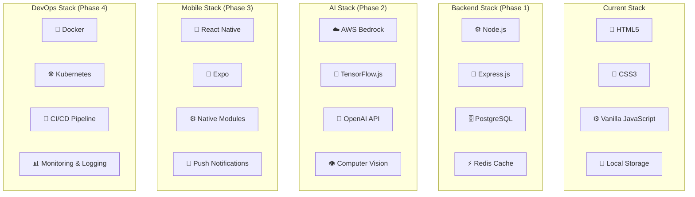

## Conclusion

The SheBalance website architecture is designed for scalability, maintainability, and user experience. The current implementation provides a solid foundation for future enhancements while delivering a comprehensive platform for women's empowerment and skill development.

The architecture emphasizes:
- **User-Centric Design**: Intuitive navigation and workflow
- **AI Integration**: Intelligent skill assessment and recommendations
- **Responsive Experience**: Cross-device compatibility
- **Modular Structure**: Easy maintenance and feature additions
- **Performance Optimization**: Fast loading and smooth interactions

This architecture document serves as a blueprint for current development and future enhancements of the SheBalance platform.